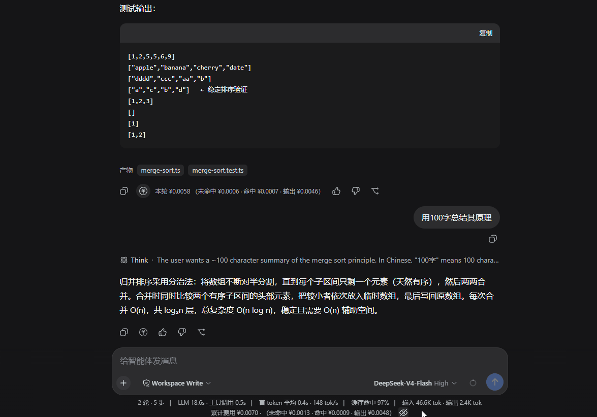
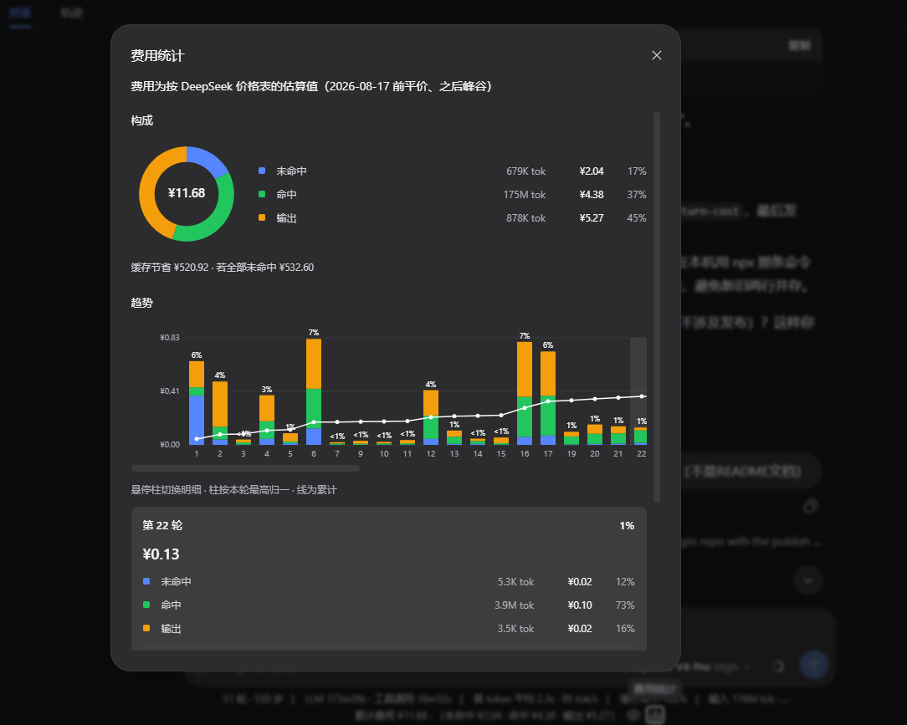

# dsh-cost-plugin

[中文](README.md) | English

[](https://www.npmjs.com/package/@javenlu233/dsh-cost-monitor)
[](https://www.npmjs.com/package/@javenlu233/dsh-cost-monitor)
[](./LICENSE)
[](https://www.typescriptlang.org/)
[](https://react.dev/)
[](https://pnpm.io/)
[](https://www.npmjs.com/package/@deepseek-ai/dsh)

DeepSeek Harness (DSH) cost display plugin: session total in the composer dock, per-turn cost on each assistant message, plus session cost charts.





- `@javenlu233/dsh-session-cost` — host projection (`sessionCost`), priced per request by model and time.
- `@javenlu233/dsh-client-ui-turn-cost` — client UI (session total + per-message “this turn”).
- `@javenlu233/dsh-cost-monitor` — aggregate package that installs both.

## Install (end users)

With [Node.js](https://nodejs.org/) installed:

```bash
npx @deepseek-ai/dsh plugin --profile web add @javenlu233/dsh-cost-monitor
npx @deepseek-ai/dsh web
```

`dsh plugin` forwards to pnpm in the profile directory. A bare package name writes a normal semver range, so routine installs do not need a hard-coded version. A freshly published release may still be held back by pnpm's `minimumReleaseAge` or delayed by an npm mirror; that is a package-manager / registry delay, not a reason to permanently pin the version. To verify a new release immediately, wait for registry propagation, or temporarily set `registry=https://registry.npmjs.org` in the profile `.npmrc`; you can also set `minimumReleaseAge: 0` in `pnpm-workspace.yaml`.

After the browser opens, wait a few seconds and hard-refresh (Windows / Linux: `Ctrl+Shift+R`, macOS: `Cmd+Shift+R`). You should see the session total at the bottom and a cost control on each assistant message. If not, restart `dsh web` and hard-refresh again.

If you already have a `dsh` binary, use that instead of `npx @deepseek-ai/dsh`. Requires DSH `0.1.1-rc.1` or newer (the `session-projection` `stateSchema` / `wire` contract).

Uninstall:

```bash
npx @deepseek-ai/dsh plugin --profile web remove @javenlu233/dsh-cost-monitor
```

### Update to the latest release

No uninstall or hand-written version is needed. `--latest` makes pnpm select npm's `latest` tag and update the dependency range in the profile:

```bash
npx @deepseek-ai/dsh plugin --profile web update --latest @javenlu233/dsh-cost-monitor
```

Restart `dsh web` and hard-refresh.

Check what is installed and what npm reports as latest:

```bash
npx @deepseek-ai/dsh plugin --profile web list
npm view @javenlu233/dsh-cost-monitor version
```

This flow is verified against the current dsh source: install with the bare package name, then run `update --latest`; the aggregate package and its two children update together, and dsh reconciles the `session-cost` / `ui-turn-cost` bundle layers.

## Historical sessions

Cost is folded from the session’s full usage log. The plugin need not have been installed when the session was recorded. After install and restart, older sessions still show a whole-log total; assistant messages still in the window also get a “this turn” line.

Paging and compaction do not change the session total. Compressed turns that are no longer in the window have no per-turn row, but their cost remains in the total. Each usage sample is priced by its event time and the route price revision active then, so historical usage is not repriced after a later change.

## Pricing

Figures are **estimates** from the configured table, not an official invoice: peak/off-peak uses each sample’s event time (assembled-message time, not request start), and mid-session model switches are priced only at `request/context` resolution. Results may differ from the provider bill. Units are **CNY per 1M tokens**. Cache writes are billed at the miss rate. Missing or unknown model ids fall back to the new default route `deepseek-flash`.

Built-in DeepSeek prices (CNY per 1M tokens; peak windows Mon–Fri Beijing 9:00–12:00 and 14:00–18:00, off-peak otherwise). Old V4 peak/off-peak pricing starts 2026-08-17 00:00 Beijing time; V4.1-Flash pricing starts 2026-09-10 12:00; V4-Pro routes to the V4.1-Flash rates from 2026-09-14 12:00:

| Model | Period | Hit | Miss | Cache write | Output |
| --- | --- | ---: | ---: | ---: | ---: |
| `deepseek-flash` (new default) | Flat (before 2026-08-17) | 0.02 | 1 | 1 | 2 |
| | Peak (before 2026-09-10) | 0.10 | 3 | 3 | 9 |
| | Off-peak (before 2026-09-10) | 0.05 | 1.5 | 1.5 | 4.5 |
| | Peak (from 2026-09-10) | 0.04 | 2 | 2 | 8 |
| | Off-peak (from 2026-09-10) | 0.02 | 1 | 1 | 4 |
| `deepseek-v4-flash` / `deepseek-v4-flash-vision-exp` (legacy aliases) | Same as above | Same | Same | Same | Same |
| `deepseek-v4-pro` | Flat (pre-change) | 0.025 | 3 | 3 | 6 |
| | Peak (before 2026-09-14) | 0.30 | 9 | 9 | 27 |
| | Off-peak (before 2026-09-14) | 0.15 | 4.5 | 4.5 | 13.5 |
| | Peak (from 2026-09-14, routed to V4.1-Flash) | 0.04 | 2 | 2 | 8 |
| | Off-peak (from 2026-09-14, routed to V4.1-Flash) | 0.02 | 1 | 1 | 4 |

`deepseek-v4-flash` and `deepseek-v4-flash-vision-exp` are legacy aliases and use V4.1-Flash rates after the cut; image tokens are already included in API-reported input usage — the plugin does not recompute from image dimensions.

### Custom prices

Edit the profile’s `cordis.patch.yml` (default `~/.dsh/profiles/web/cordis.patch.yml`) and override `session-cost` `config` by id. A patch **replaces** `config` wholesale (no field-level merge with defaults); `prices` is also replaced wholesale, so include every model you need. Omitted top-level config keys still use schema defaults.

```yaml
- id: session-cost
  config:
    currency: CNY
    defaultRoute: deepseek-flash
    # 2026-08-17 00:00 Beijing; earlier usage uses flat
    effectiveAt: 1786896000000
    peakWindows: [[9, 12], [14, 18]]
    timezoneOffsetMinutes: 480
    prices:
      deepseek-flash:
        flat: { cacheRead: 0.02, uncachedInput: 1, cacheWrite: 1, output: 2 }
        peak: { cacheRead: 0.10, uncachedInput: 3, cacheWrite: 3, output: 9 }
        offPeak: { cacheRead: 0.05, uncachedInput: 1.5, cacheWrite: 1.5, output: 4.5 }
        updates:
          - effectiveAt: 1789012800000 # 2026-09-10 12:00 Beijing time
            peak: { cacheRead: 0.04, uncachedInput: 2, cacheWrite: 2, output: 8 }
            offPeak: { cacheRead: 0.02, uncachedInput: 1, cacheWrite: 1, output: 4 }
      deepseek-v4-flash:
        flat: { cacheRead: 0.02, uncachedInput: 1, cacheWrite: 1, output: 2 }
        peak: { cacheRead: 0.10, uncachedInput: 3, cacheWrite: 3, output: 9 }
        offPeak: { cacheRead: 0.05, uncachedInput: 1.5, cacheWrite: 1.5, output: 4.5 }
        updates:
          - effectiveAt: 1789012800000
            peak: { cacheRead: 0.04, uncachedInput: 2, cacheWrite: 2, output: 8 }
            offPeak: { cacheRead: 0.02, uncachedInput: 1, cacheWrite: 1, output: 4 }
      deepseek-v4-flash-vision-exp:
        flat: { cacheRead: 0.02, uncachedInput: 1, cacheWrite: 1, output: 2 }
        peak: { cacheRead: 0.10, uncachedInput: 3, cacheWrite: 3, output: 9 }
        offPeak: { cacheRead: 0.05, uncachedInput: 1.5, cacheWrite: 1.5, output: 4.5 }
        updates:
          - effectiveAt: 1789012800000
            peak: { cacheRead: 0.04, uncachedInput: 2, cacheWrite: 2, output: 8 }
            offPeak: { cacheRead: 0.02, uncachedInput: 1, cacheWrite: 1, output: 4 }
      deepseek-v4-pro:
        flat: { cacheRead: 0.025, uncachedInput: 3, cacheWrite: 3, output: 6 }
        peak: { cacheRead: 0.30, uncachedInput: 9, cacheWrite: 9, output: 27 }
        offPeak: { cacheRead: 0.15, uncachedInput: 4.5, cacheWrite: 4.5, output: 13.5 }
        updates:
          - effectiveAt: 1789358400000 # 2026-09-14 12:00 Beijing time
            peak: { cacheRead: 0.04, uncachedInput: 2, cacheWrite: 2, output: 8 }
            offPeak: { cacheRead: 0.02, uncachedInput: 1, cacheWrite: 1, output: 4 }
```

Add other models under `prices` with the provider-owned model id. Restart `dsh web` after edits.

## Development

### Layout

```
cost-plugin/
├─ packages/
│  ├─ session/session-cost/    # host projection
│  ├─ client/ui-turn-cost/     # client UI (dsh.client browser half)
│  └─ cost-monitor/            # aggregate: merged cordis.patch.yml
├─ scripts/link-profile.mjs    # junction family packages into ~/.dsh/profiles/node_modules/@javenlu233
├─ package.json / pnpm-workspace.yaml / .npmrc
```

### Build

```bash
pnpm install
pnpm build   # or pnpm -r build
```

Artifacts: `packages/*/*/lib/{index,invariant}.js` + `packages/client/ui-turn-cost/lib/client.js`.

After code changes: `pnpm build` (or build only what changed) → restart `dsh web` → `Ctrl+Shift+R`. Re-run `link-profile` only when package paths change.

### Release flow

Follow this path; do not skip beta straight to `latest`:

1. **Local link** until it works
2. **Publish beta**, verify with npm `@beta`
3. **PR into `main`**
4. **Publish the release** (`latest`)

Publishing details (order, OTP, `workspace:^`) are in [PUBLISHING.md](./PUBLISHING.md). All three package `version` fields must move together. Before a release, move [CHANGELOG.md](./CHANGELOG.md) `Unreleased` entries under the new version heading with a date.

#### 1. Local link

Do not patch DSH source. On Windows, run `pnpm dsh ...` from the harness repo; avoid `npx @deepseek-ai/dsh` (the bin may point at a missing `lib/bin.js`).

```bash
# 1. Build
pnpm install && pnpm build

# 2. Link family packages into the profile (children of the aggregate resolve through this)
node scripts/link-profile.mjs

# 3. Install the aggregate via local link (replace <repo> with the repo root absolute path)
dsh plugin --profile web remove @javenlu233/dsh-cost-monitor
dsh plugin --profile web add "link:<repo>/packages/cost-monitor"

# 4. Restart dsh web; wait a few seconds after open, then hard-refresh
dsh web
```

Check: `dsh --profile web --dump-config` should show `# == @javenlu233/dsh-cost-monitor` and both `session-cost` / `ui-turn-cost` rows.

#### 2. Publish beta

Bump all three packages to a prerelease (e.g. previous release `0.1.1` → `0.1.2-beta.0`), build, publish with `--tag beta` (does **not** move `latest`):

```bash
pnpm build

cd packages/session/session-cost && pnpm publish --tag beta --no-git-checks && cd ../../..
cd packages/client/ui-turn-cost && pnpm publish --tag beta --no-git-checks && cd ../../..
cd packages/cost-monitor && pnpm publish --tag beta --no-git-checks && cd ../..
```

Remove the link and install beta:

```bash
dsh plugin --profile web remove @javenlu233/dsh-cost-monitor
dsh plugin --profile web add @javenlu233/dsh-cost-monitor@beta
```

Use `@beta` or the full prerelease; beta validation does not use the stable bare package name. Restart `dsh web` and hard-refresh.

#### 3. PR into main

After beta checks out, open a PR and merge to `main`. Do not publish the release before merge.

#### 4. Publish the release

On `main`, set all three `version` fields to the release (e.g. `0.1.4`, drop `-beta.0`), build, and publish **without** `--tag` (default `latest`). Keep the install section on the bare package name; it does not need a version edit for every release.

```bash
pnpm build

cd packages/session/session-cost && pnpm publish --no-git-checks && cd ../../..
cd packages/client/ui-turn-cost && pnpm publish --no-git-checks && cd ../../..
cd packages/cost-monitor && pnpm publish --no-git-checks && cd ../..
```

Verify an installed profile with a direct update:

```bash
dsh plugin --profile web update --latest @javenlu233/dsh-cost-monitor
```

Restart and hard-refresh.

## Known limitations

Values are estimates: peak/off-peak uses message-assembly time, model switches only at `request/context` granularity, and figures may diverge from the provider bill. `web_search`-triggered flash summary usage appears in the turn total and the chart’s search cut; sessions recorded before the plugin was installed cannot recover that cut. Vision image cost depends on API-reported usage (images already folded into input tokens); the plugin does not reprice by resolution.

`dsh-session-cost` needs the host `sessionProjections` service; `ui-turn-cost` needs the `composer.dock` / `assistant-actions` slots. Those APIs come from DSH’s `@deepseek-ai/dsh-*` packages. Standalone builds leave them external and do not install them as devDependencies (that would pull unpublished transitive deps); they are peer-provided by a real `dsh web` host. Local link + real `dsh web` works; confirm the DSH version includes the APIs and the `session-projection` `stateSchema` + `wire` contract (about `0.1.1-rc.1` onward).

See [CHANGELOG.md](./CHANGELOG.md) for version history.

## License

MIT; see [LICENSE](./LICENSE).
