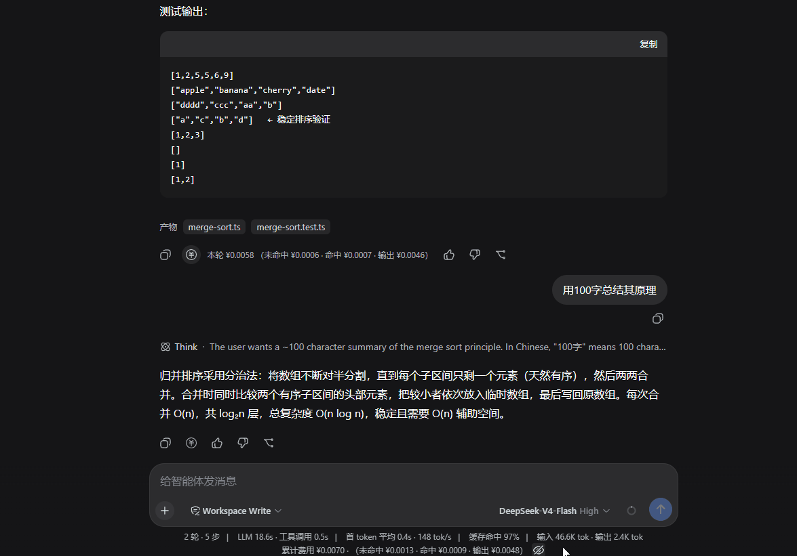
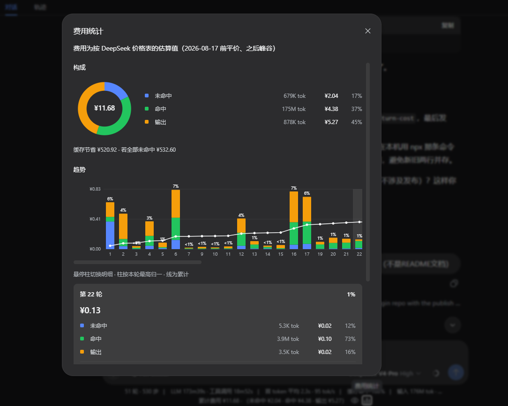

# dsh-cost-plugin

DeepSeek Harness (DSH) 费用展示插件: 底部累计 + 每轮费用 + 会话统计图。





- `@javenlu233/dsh-session-cost` — host 侧投影（`sessionCost`），按每次请求的模型/时间计价。
- `@javenlu233/dsh-client-ui-turn-cost` — client 侧展示（底部累计 + 每消息「本轮」）。
- `@javenlu233/dsh-cost-monitor` — 聚合包，一键装齐上面两个。

## 安装（使用者）

装好 [Node.js](https://nodejs.org/) 后执行：

```bash
npx @deepseek-ai/dsh plugin --profile web add @javenlu233/dsh-cost-monitor@0.1.2 # 此处的版本号随每次正式发布更新
npx @deepseek-ai/dsh web
```

> 这里写死版本，是因为 DSH web profile 对 npm 新包有 24 小时冷却：不写版本或写 `@latest` 时，刚发布的 `0.1.2` 会被跳过，实际装上的可能是更早的 `0.1.0`。钉死后装的就是这一版。

浏览器打开后，插件有时不会立刻出现：等几秒再强制刷新（Windows / Linux：`Ctrl+Shift+R`，macOS：`Cmd+Shift+R`）。底部应出现「累计费用」，每条助手消息有「费用」按钮。若刷新后仍没有，关掉 `dsh web` 再启动一次，然后再强制刷新。

本机已有 `dsh` 命令时，把 `npx @deepseek-ai/dsh` 换成 `dsh` 即可。需要 DSH `0.1.0-rc.6` 及以上。

卸载：

```bash
npx @deepseek-ai/dsh plugin --profile web remove @javenlu233/dsh-cost-monitor
```

## 历史会话

费用从会话的完整用量日志折算，不要求当时已经装着本插件。装好并重启后，打开装插件之前的旧会话，底部同样会给出整段累计费用；每条仍加载在窗口里的助手消息也可以看「本轮」。

分页、压缩不会改累计总额。已被压缩、不在当前窗口里的回合没有单独的「本轮」行，它们的费用仍计入底部累计。每条用量按它自己的事件时间套价格表（2026-08-17 前走平价，之后走峰谷），所以跨涨价日的旧会话也会按当时时段计价。

## 计价

费用是按配置表的**估算**，不是官方账单：峰谷取各用量样本的事件时间（组装 message 的时间，不是请求开始时间），中途换模型只按 `request/context` 的粒度计价，结果可能和 provider 账单有出入。单位为 **人民币 / 百万 token**。缓存写入按未命中价计。未记录模型或表中没有该模型时，回退到 `deepseek-v4-flash`。

内置 DeepSeek 价格（2026-08-17 00:00 北京时间起从平价切到峰谷；峰时为北京时间 9:00–12:00、14:00–18:00）：

| 模型 | 时段 | 命中 | 未命中 | 缓存写 | 输出 |
| --- | --- | ---: | ---: | ---: | ---: |
| `deepseek-v4-flash` | 平价（涨价前） | 0.02 | 1 | 1 | 2 |
| | 峰时 | 0.10 | 3 | 3 | 9 |
| | 谷时 | 0.05 | 1.5 | 1.5 | 4.5 |
| `deepseek-v4-pro` | 平价（涨价前） | 0.025 | 3 | 3 | 6 |
| | 峰时 | 0.30 | 9 | 9 | 27 |
| | 谷时 | 0.15 | 4.5 | 4.5 | 13.5 |

### 自定义价格

编辑 profile 的 `cordis.patch.yml`（默认 `~/.dsh/profiles/web/cordis.patch.yml`），按 id 覆盖 `session-cost` 的 `config`。patch **整段替换** `config`，不会和默认表做字段级合并；`prices` 也是整表替换，要改价请把用到的模型都写全。未写的配置项仍走插件 schema 默认值。

```yaml
- id: session-cost
  config:
    currency: CNY
    defaultRoute: deepseek-v4-flash
    # 2026-08-17 00:00 北京时间；更早的用量走 flat
    effectiveAt: 1786896000000
    peakWindows: [[9, 12], [14, 18]]
    timezoneOffsetMinutes: 480
    prices:
      deepseek-v4-flash:
        flat: { cacheRead: 0.02, uncachedInput: 1, cacheWrite: 1, output: 2 }
        peak: { cacheRead: 0.10, uncachedInput: 3, cacheWrite: 3, output: 9 }
        offPeak: { cacheRead: 0.05, uncachedInput: 1.5, cacheWrite: 1.5, output: 4.5 }
      deepseek-v4-pro:
        flat: { cacheRead: 0.025, uncachedInput: 3, cacheWrite: 3, output: 6 }
        peak: { cacheRead: 0.30, uncachedInput: 9, cacheWrite: 9, output: 27 }
        offPeak: { cacheRead: 0.15, uncachedInput: 4.5, cacheWrite: 4.5, output: 13.5 }
```

给其他模型加价：在 `prices` 里用 provider 侧模型 id 再加一项。改完后重启 `dsh web`。

## 开发

### 结构

```
cost-plugin/
├─ packages/
│  ├─ session/session-cost/    # host 投影
│  ├─ client/ui-turn-cost/     # client 展示（dsh.client 浏览器半）
│  └─ cost-monitor/                # 聚合包：汇总的 cordis.patch.yml
├─ scripts/link-profile.mjs    # 把子包 junction 进 ~/.dsh/profiles/node_modules/@javenlu233
├─ package.json / pnpm-workspace.yaml / .npmrc
```

### 构建

```bash
pnpm install
pnpm build   # 或 pnpm -r build
```

产物：`packages/*/*/lib/{index,invariant}.js` + `packages/client/ui-turn-cost/lib/client.js`。

改代码后：`pnpm build`（或只 build 改过的包）→ 重启 `dsh web` → `Ctrl+Shift+R`。`link-profile` 只需包路径变了才重跑。

### 发布流程

按这条链路走，不要跳过 beta 直接发 `latest`：

1. **本地 link** 调通
2. **发 beta 包**，用 npm 的 `@beta` 再验一遍
3. **PR 合进 `main`**
4. **发正式包**（`latest`）

发包细节（顺序、OTP、`workspace:^`）见 [PUBLISHING.md](./PUBLISHING.md)。三个包的 `version` 必须一起改。

#### 1. 本地 link

不改 DSH 源码。Windows 上请在 harness 仓库里用 `pnpm dsh ...`，不要 `npx @deepseek-ai/dsh`（bin 可能指到不存在的 `lib/bin.js`）。

```bash
# 1. 构建
pnpm install && pnpm build

# 2. 把子包链接进 profile（聚合包的 children 依赖靠这个解析）
node scripts/link-profile.mjs

# 3. 用本地 link 装聚合包（把 <repo> 换成仓库根目录的绝对路径）
dsh plugin --profile web remove @javenlu233/dsh-cost-monitor
dsh plugin --profile web add "link:<repo>/packages/cost-monitor"

# 4. 重启 dsh web；打开页面后等几秒再强制刷新
dsh web
```

验证：`dsh --profile web --dump-config` 应出现 `# == @javenlu233/dsh-cost-monitor` 及 `session-cost` / `ui-turn-cost` 两行。

#### 2. 发 beta

三个包改成预发布号（例如上次正式版是 `0.1.1`，这次用 `0.1.2-beta.0`），构建后带 `--tag beta` 发布，**不会**覆盖 `latest`：

```bash
pnpm build

cd packages/session/session-cost && pnpm publish --tag beta --no-git-checks && cd ../../..
cd packages/client/ui-turn-cost && pnpm publish --tag beta --no-git-checks && cd ../../..
cd packages/cost-monitor && pnpm publish --tag beta --no-git-checks && cd ../..
```

卸掉 link，改装 beta：

```bash
dsh plugin --profile web remove @javenlu233/dsh-cost-monitor
dsh plugin --profile web add @javenlu233/dsh-cost-monitor@beta
```

必须写 `@beta` 或完整预发布号。不要用裸包名或 `@latest`（冷却原因见上文「安装」）。重启 `dsh web` 并强制刷新。

#### 3. PR 合进 main

beta 验证通过后开 PR，合进 `main`。不要在合入前发正式包。

#### 4. 发正式包

在 `main` 上把三个包的 `version` 改成正式号（例如 `0.1.2`，去掉 `-beta.0`），构建后**不要**加 `--tag`（默认 `latest`）。发完后把上文「安装（使用者）」里的 `@0.1.2` 改成新号。

```bash
pnpm build

cd packages/session/session-cost && pnpm publish --no-git-checks && cd ../../..
cd packages/client/ui-turn-cost && pnpm publish --no-git-checks && cd ../../..
cd packages/cost-monitor && pnpm publish --no-git-checks && cd ../..
```

验证安装用同一钉死版本：

```bash
dsh plugin --profile web add @javenlu233/dsh-cost-monitor@0.1.2
```

重启并强制刷新。

## 已知限制

显示值是估算：峰谷用 message 组装时间而非请求开始时间，换模型只按 `request/context` 的粒度，可能和 provider 账单不一致。

`dsh-session-cost` 依赖 host 的 `sessionProjections` 投影服务、`ui-turn-cost` 依赖
`composer.dock` / `assistant-actions` 两个 slot。这些 API 来自 DSH 的 `@deepseek-ai/dsh-*`
官方包；独立构建时它们作为 external 不打包、也不作为 devDependencies 安装（否则会拉取
npm 上尚未发布的传递依赖），改为在 peerDependencies 中声明、由真实 `dsh web` 宿主提供。
因此在「本地 link + 真实 dsh web」下可跑；需确认DSH 版本
已包含上述 API。

## License

MIT，见 [LICENSE](./LICENSE)。
